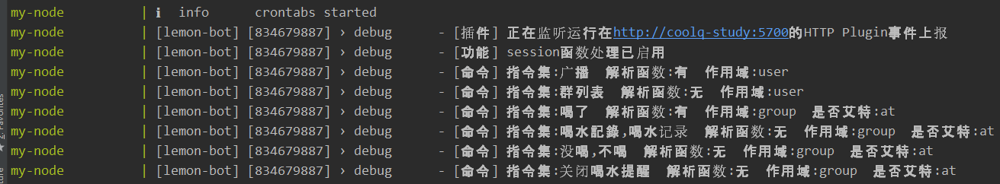

# Biu ~
这是个人的QQ机器人项目，使用 [lemon-bot](https://github.com/XHMM/lemon-bot) 框架编写，目前包含了两个机器人：

### 小心机器人(study bot)
该机器人功能较为丰富，面向大众使用，详细功能可见直接查看[源码](https://github.com/XHMM/bot-xiaoxin/tree/master/src/commands/study_bot)。

### 同步机器人(sync bot)
该机器人是为满足个人的一个"备份"需求所开发，功能仅有一个([源码](https://github.com/XHMM/bot-xiaoxin/tree/master/src/commands/sync_bot))：向该机器人发送的任何文本消息都会备份在服务端，以避免本地QQ消息过时或丢失。


## 本地使用：
该项目使用docker进行了很粗糙的封装，以方便各路豪杰快速上手体验甚至开发自己的机器人：
1. 安装docker
2. 修改`.env`文件中的内容，详见该文件的注释
2. 在项目根目录下运行`docker-compose up`命令。待命令行内打印类似如下的日志后表明运行docker成功：
    
    

2. 此时你的本地会多出一个目录，路径即为`Coolq_Volume`的值，进入到`[Coolq_Volume]/app/io.github.richardchien.coolqhttpapi/config`目录下，创建`[Study_Bot值].json`文件，并写入如下内容：
    ```json
    {
      "host": "[::]",
      "port": 5700,
      "use_http": true,
      "post_url": "http://node:8888/coolq",
      "post_message_format": "array",
      "show_log_console": true,
      "log_level": "info",
      "convert_unicode_emoji": false
    }
    ```
2. 然后打开浏览器，输入网址`localhost:[port]`，其中`port`值为`.env`文件中`Study_Bot_VNC_Port`的值。vnc登录页面的密码为`Study_Bot_VNC_Pwd`的值，然后会进入酷Q登录页面，QQ账号即为`Study_Bot`对应的值，密码即他的QQ密码。(若要继续开启同步机器人，则按照相同步骤打开对应vnc登录其账号即可)

2. 现在，向`[Study_Bot]`发送一个"帮助"，然后：豪侠，开始使用吧！

## 注意
1. 你也许需要使用代理来确保`Dockerfile`可被正常构建，查看该文件上方的注释来配置代理。若有更好的配置办法比如使用镜像等，请少侠务必提个issue或PR
2. 数据库文件的持久化问题：在[mongo](https://hub.docker.com/_/mongo)的dockerhub页面末可看到目前不支持Windows和OS X系统下的数据文件夹映射。So terrible，若哪位少侠有解决措施请务必提个issue或PR